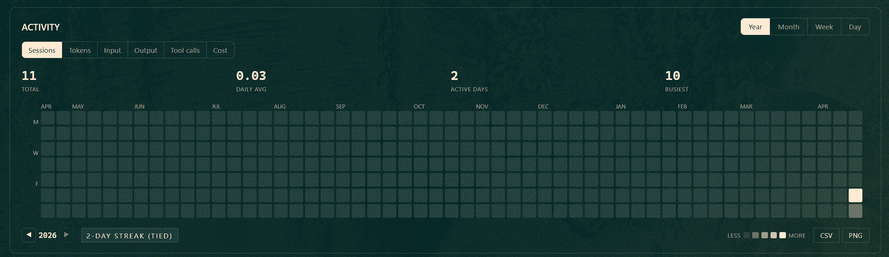
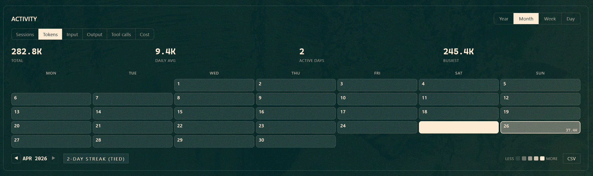
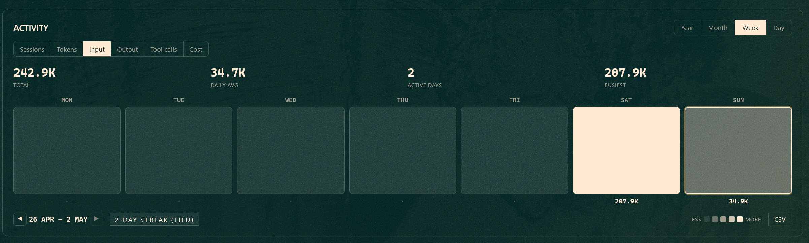
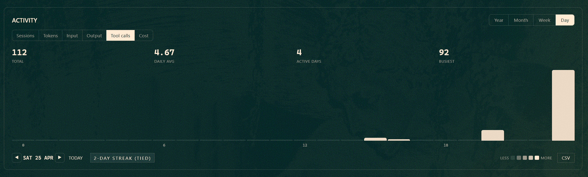
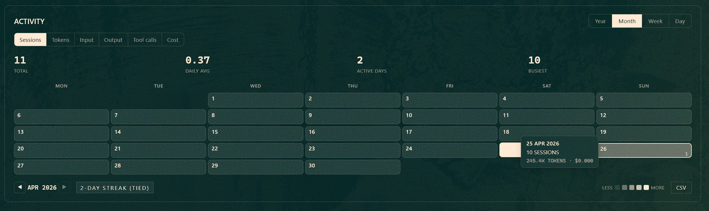
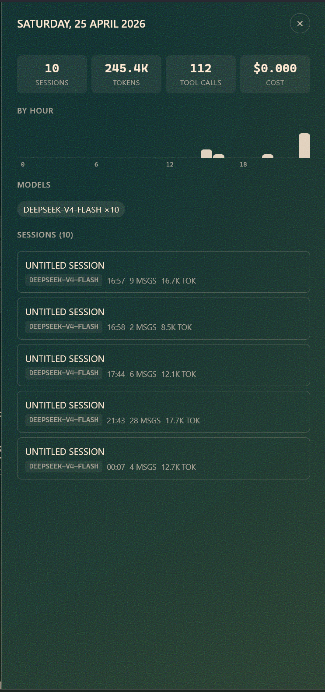
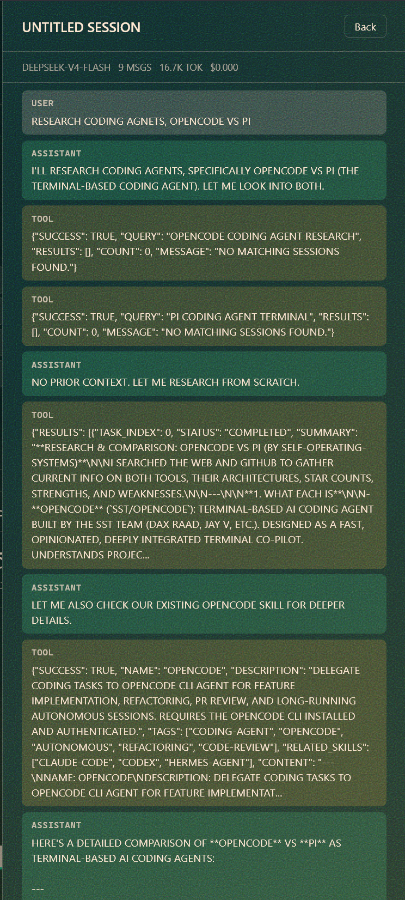
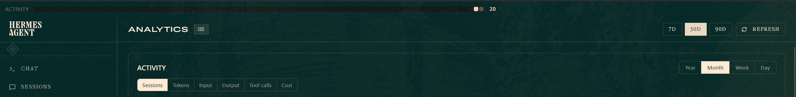

# Activity Heatmap for Hermes

GitHub-style contribution heatmap for the [Hermes Agent](https://github.com/NousResearch/hermes-agent) dashboard. Track your agent usage at a glance — sessions, tokens, tool calls, and cost — across four time scales with click-through drill-down and streak tracking.

## Screenshots

**Year view** — full heatmap with inline metric/platform filters, streak badge, and legend



**Month view** — true calendar grid with per-day values



**Week view** — 7-day column view with colored bars



**Day view** — 24-hour bar chart



**Tooltip** — hover any cell for quick stats



**Expanded tooltip** — detailed view on hover



**Session view** — click a session to view messages inline



**Header strip** — compact 12-week mini heatmap in the top nav



## Features

**Four time scales**
- **Year** — 53-week SVG grid (~370 cells, no charting library)
- **Month** — true calendar grid (7×6) with day numbers and metric values
- **Week** — 7-day column view with colored bars
- **Day** — 24-hour bar chart with hover tooltips

**Six metrics** — switch between Sessions, Total Tokens, Input Tokens, Output Tokens, Tool Calls, and Cost with inline button filters

**Per-platform filter** — filter by source (CLI, Telegram, Discord, Slack, etc.)

**Click-through drill-down** — click any cell to open a slide-in panel showing:
- Daily summary stats (sessions, tokens, tool calls, cost)
- Hour-by-hour activity breakdown
- Models used that day
- Session list with title, model, time, message count, and tokens

**Inline session viewer** — click a session card to view its full message history

**Streak tracking** — current streak with all-time best

**Header strip** — compact 12-week mini heatmap in the top nav, click to scroll to the full view

**Theme-aware** — inherits your active dashboard theme colors via CSS variables

**Export** — CSV export for all views, PNG export for year view

**Polish** — animated cell reveal, today indicator with pulse, loading shimmer, empty state

## Install

```bash
git clone https://github.com/Masterlincs/hermes-activity-heatmap ~/.hermes/plugins/activity-heatmap
```

Then restart `hermes dashboard` or rescan plugins:

```bash
curl http://127.0.0.1:9119/api/dashboard/plugins/rescan
```

The heatmap appears at the top of the **Analytics** page. A compact mini heatmap also appears in the header strip.

## How it works

The plugin reads from Hermes' `SessionDB` and aggregates sessions by day/hour on the backend using a FastAPI router. The frontend renders everything with vanilla JS and React (via the plugin SDK) — no external charting libraries. The year view uses an inline SVG with ~370 `<rect>` elements, sized dynamically to fit the container.

All styles use CSS variables from the active dashboard theme, so switching themes restyles the heatmap automatically.

All code is isolated to `~/.hermes/plugins/activity-heatmap/` — zero modifications to the core Hermes codebase.

## Tech

- **Backend**: FastAPI router (`plugin_api.py`) — session aggregation, streak calculation, CSV export
- **Frontend**: Vanilla JS + React via Hermes Plugin SDK (`dist/index.js`)
- **Styles**: Pure CSS with theme variables (`dist/style.css`)
- **No dependencies** — ships as two compiled files

## License

MIT
